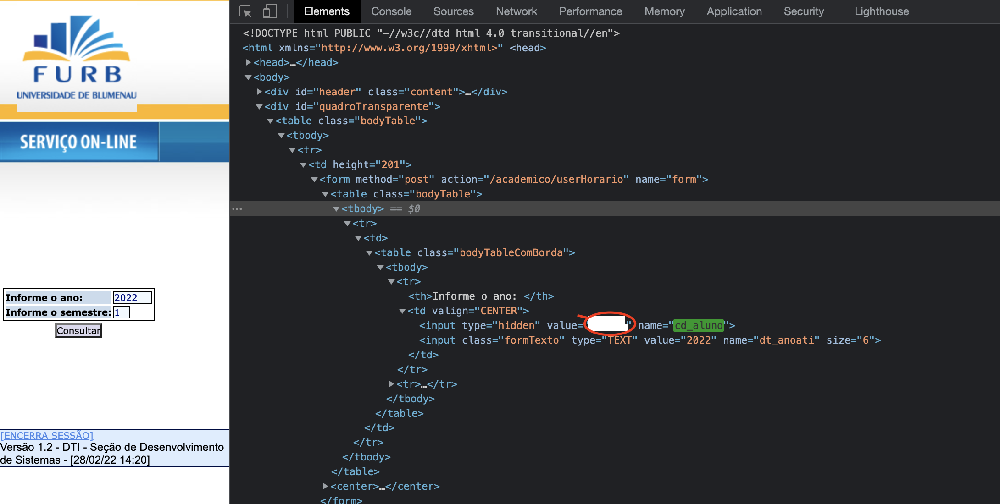

# Dart FURB API
## A Dart Wrapper + Beautiful Soup for Scrapping

- - -

# WARNING:  It's a hacky API, may break any time

When you access https://www.furb.br/academico/uHorario after you are logged, in the HTML page you have the student code loaded in a hidden tag (shitty developers!! 💩)



# How it works

## Login

[POST] https://www.furb.br/academico/validaLogon

## Body (Form-data):

| Key       | Value      | Description
------------|------------|-------------
nm_login     | string    | Your username without @furb.br
ds_senha     | string    | your password
nome_servlet | string    | this is a redirect, only work this way, shitty developers!! 💩

## Eg:
```
nm_login:[your_username]
ds_senha:[your_password]
nome_servlet:https://www.furb.br/academico/servicosAcademicos
```

## Response

On Login response you get the header for Authentication usage ("Token" expires on 5 minutes or 30 minutes, it's random)

```curl
Cookie: JSESSIONID=XXXXXXXXX
```

Eg:

```url
https://www.furb.br/academico/userHorario;JSESSIONID=XXXXXXXXXXX
```

---

## Timetable

| Key       | Value     | Description
------------|-----------|-------------
cd_aluno    | string    | Your studentCode
dt_anoati   | string    | year (default: current year)
dt_semati   | string    | (1-2) first half or second half period

## Eg:
```
cd_aluno:[student_code]
dt_anoati:[year]
dt_semati:[period]
```

---

After that you just scrap the HTML content and so on!

You got all tools! Good luck! 😊